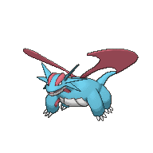

#### Reason for evaluation of dataset: 

Pokemon is one of the largest grossing media franchises globally with an estimated worth of over 110 Billion USD across its revenue in merchandise, games, and other media. The recent release of Pokemon Legends: ZA has an estimated sale of 5 million copies globally within its first week of release. The Pokemon Trading Card Game has also gained popularity within this past year with estimated 1.3 billion USD in revenue for TCG Pocket app as of October 2025.  Due to recent release of this title and current popularity of the trading card game, there has been a recurrence of interest in Pokemon.  Along with this recurrence of popularity, comes with increased inquiry regarding the original games that both Pokemon Legends: ZA and Pokemon TCG set "Mega Evolutions" are based on.

The titles that comes to re-evaluation are Generations 6 and 7 which includes the following Pokemon titles: Pokemon X/Y, Pokemon Omega Ruby/Alpha Sapphire, Pokemon Sun/Moon and Pokemon Ultra Sun/Ultramoon. The interesting detail for these specific generations is that Generation 6 introduces two historic changes for the Pokemon franchise. These changes include the introduction of the fairy type and introduction of regional gimmicks with Mega evolution.

The primary reason for introduction of Fairy type was for competitive gameplay balancing by providing an additional counter that is effective to Dragon-types. The Dragon-type has been a historically dominant presence in both casual gameplay and on the competitive scene due to its type resistances and overall higher average base stats compared to other types (seen on Tableau Sheet 1 and Sheet 8).
Prior to the introduction of Fairy-types, there were two effective types against Dragon-types: Ice and ironically Dragon type. While Ice-types do have a x4 modifier effectiveness against Dragon-types, competitively speaking Ice-types are still not viable due to having the 5th slowest average speed stats. Ice types also have four type weaknesses: Fighting, Fire, Steel and Rock. Whether intentional or not, almost all Dragon-type pokemon have access to attack-moves that are effective against Ice-types. In layman's terms, this means that even before a Ice-type pokemon can even land a hit on a Dragon-type, the Dragon type pokemon can easily one hit knock out the ice type due to increased speed stat and attack-availability that are effective against Ice-type Pokemon. 
However, interestingly despite Fairy-type being designed to counter Dragon-type, for gameplay purposes fairy-type had to be designed with a flaw with weaknesses to poison and steel.  

Regional gimmicks such as Mega evolution were introduced to gameplay to shake up gameplay and to provide further competitive balancing. Mega evolution provides a pokemon additional stats but comes with the gimmick that only a selection of pokemon are to mega evolve and only one pokemon in a team can mega evolve in a battle. 
Mega evolution was also added to bring more popularity to lesser popular pokemon and provide more competitively viable pokemon outside the dragon-type pokemon. However, game developers have also given mega evolution ability to already competitively popular pokemon such as Tyranitar and Metagross and two competively necessary dragon types: Garchomp and Salamence (Seen on Sheet 6). 

##### Exploration of this dataset is to evaluate if game developers were truly able to balance type-advantages or had accidentally created further imbalance for pokemon types. 

### Results: 

Based on Data exploration, despite the balancing changes made in generations 6 and further patches on generation 7, Dragon-types were not fully able to be countered and still remain dominant due to retaining the highest average base stats and having the most pokemon of the Dragon-type remaining within the top 5 base stats for both legendary and non-legendary designation.

Despite the addition of Fairy-types, there have not been enough modifications to warrant Fairy-type to be a viable threat to Dragon-type supremacy. Fairy-types also have a lower average base stat compared to Ice-types. Fairy types also suffer from having the lowest average base speed stats compared to other types. Also due to the introduction of Mega evolution, it even further weakens the viability of Fairy-type by providing further reinforcements to Steel-type pokemon such as Metagross.

However, something to note is that Dragon-types are still not completely invulnerable and stats are not everything and there is a more complex system outside of stat distribution and type advantages. 

For example:
Se Jun Park, the champion of the 2014 Pokémon World Championships, had used Pachirisu to win the final Championship match. 
