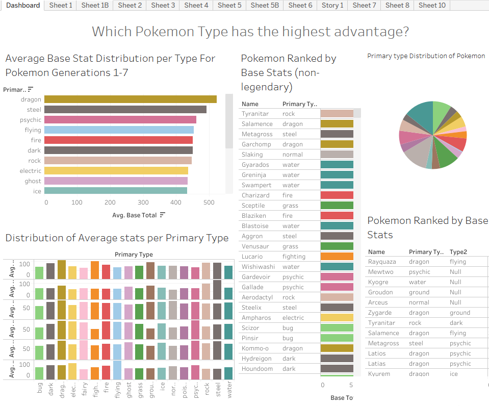

Salesforce profile: 
https://www.salesforce.com/trailblazer/boo5n4uab51cuo12h5

Screenshot of Profile and badges: 


# Tableau Dashboard and Dataset Information

Dataset used for exercise: https://www.kaggle.com/datasets/rounakbanik/pokemon/data 

```bash
Data Discepancy: Dataset only includes Pokemon up to Generations 1 - 7 From Pokemon Red/Green to Pokemon Ultra Sun/Pokemon Ultramoon released 2016-2017 for the 3DS. Data does not reflect on current competitive meta: Gen 9-Pokemon Scarlet Violet Released 2022.
```


Further information regarding pokemon: https://en.wikipedia.org/wiki/Pok%C3%A9mon

Data source for kaggle dataset: https://serebii.net/ 

Tableau: https://public.tableau.com/views/507_assign6/Dashboard2?:language=en-US&:sid=&:redirect=auth&:display_count=n&:origin=viz_share_link 




# Short written reflection.

- **Data Storytelling:**  
        One principle or best practice from *Data Storytelling with Tableau Public* that you found most important, and how it shaped the viz you created.  
One Principle that I had found important to note for Data storytelling would be to keep visualizations simple enough provide a clearer interpretation of data. 
It Shaped the viz I created to not be too overwheming to viewers. 
 - **Data Model:**  
        One key concept from *The Tableau Data Model* (e.g., relationships vs joins, working with multiple tables) and why it matters when working with real-world datasets.
Another key concept I had learned is that working with multiple tables requires fine adjustments and proper designation of data based on relationshps. This matters when working with real world datasets due to data implications. 

 - **Healthcare Scenario:**  
        A brief healthcare-specific example where using Tableau’s data model and visual storytelling would be useful (e.g., tracking patient outcomes across multiple tables such as visits, labs, and diagnoses) and why Tableau is a good fit.
Tableau's visual story telling would be useful for multiple purposes in healthcare. One particular example where tableau would be used for is emergency department tracking boards which can help healthcare staff quickly track patient flow. This would be useful in creating estimations for inpatient and admission flow which can help patient bed management quickly view and properly designate where the patient needs to go and where can they go in the hospital. Fpr example: A patient comes in for neutropenic fever after 1 week of recieving Rituximab. If the tableu dashboard is properly designed, bed board would be able to see basic information such as patient name, age, identification, current location in the ed, quick few word summary of why they came in, Doctors, PA, NP and nurses assigned to patient, medical team they are assigned to, and any particular isolation precautions. 


