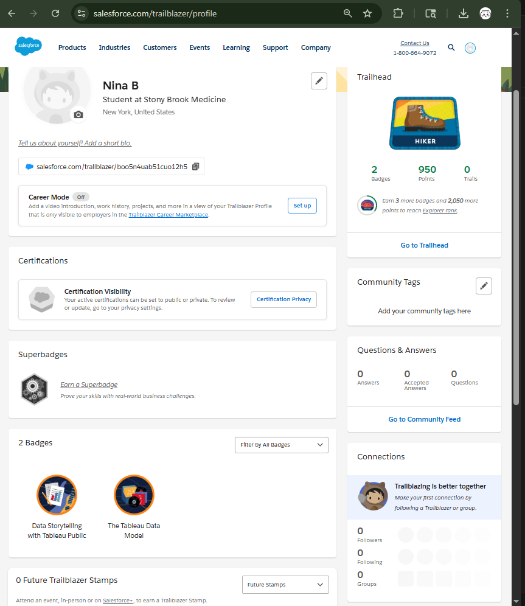
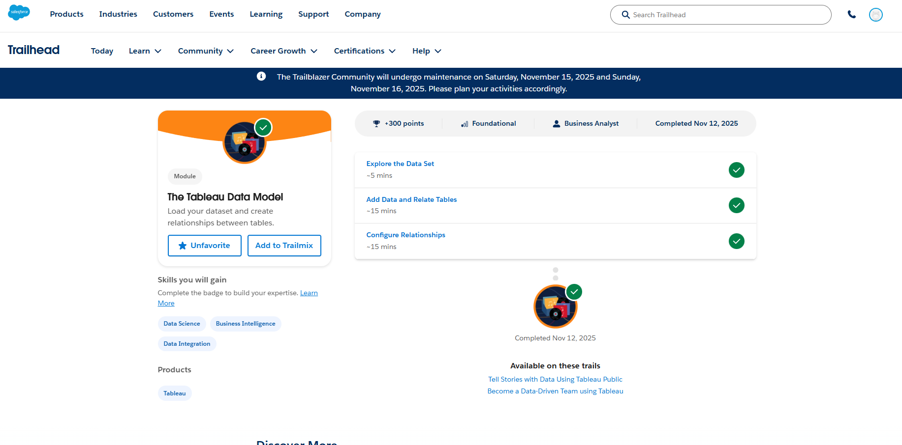
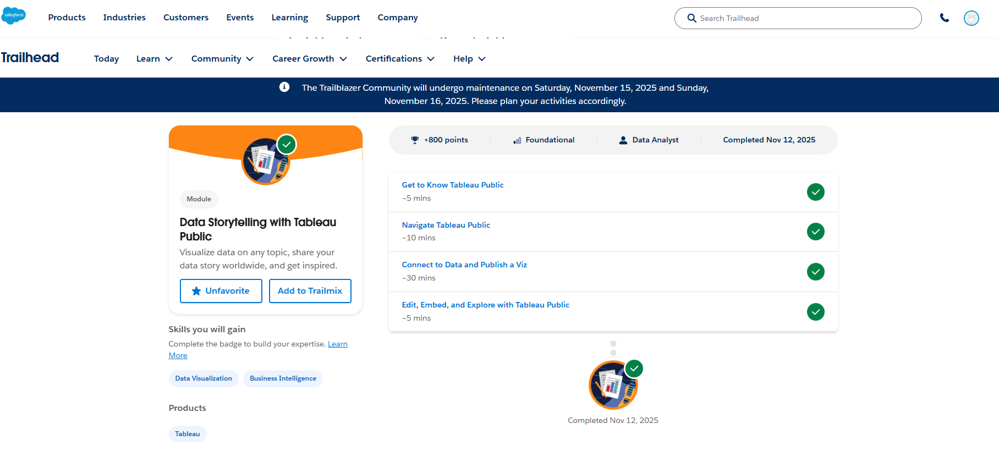

Salesforce profile: 
https://www.salesforce.com/trailblazer/boo5n4uab51cuo12h5

Screenshot of Profile and badges: 

# Tableau Dashboard and Dataset Information

Dataset used for exercise: https://www.kaggle.com/datasets/rounakbanik/pokemon/data 

Further information regarding pokemon: https://en.wikipedia.org/wiki/Pok%C3%A9mon

Data source for kaggle dataset: https://serebii.net/ 

Reason for evaluation of dataset: 

Pokemon is one of the largest grossing media franchises globally with an estimated worth of over 110 Billion USD across its revenue in merchandise, games, and other media. Recent release of Pokemon Legends: ZA has an estimated sale of 5 million copies globally within first week of release. The Pokemon Trading Card Game has also gained popularity within this past year with estimated 1.3 billion USD in revenue for TCG Pocket app as of October 2025.  Due to recent release of this title and current popularity of the trading card game, there has been a recurrence of interest in the pokemon.  Along with this recurrence of popularity, comes with increased inquiry regarding the original games that the recent release of both Pokemon Legends: ZA and Pokemon TCG set "Mega Evolutions" are based on.

Data Discepancy: Dataset only includes Pokemon up to Generations 1 - 7 From Pokemon Red/Green to Pokemon Ultra Sun/Pokemon Ultramoon released 2016-2017. Data does not reflect on current competitive meta: Gen 9-Pokemon Scarlet Violet Released 2022.

Tableau: https://public.tableau.com/views/507_assign6/Dashboard2?:language=en-US&:sid=&:redirect=auth&:display_count=n&:origin=viz_share_link 

Goal: 
1. Build one basic viz or small dashboard that:
2. Tells a simple, clear data story (e.g., “Admissions have increased in X group”, “Readmissions vary by age group”).
3. Uses at least two different visual elements (e.g., bar chart + line chart, map + bar chart, etc.).
Publish the viz to your Tableau Public profile.
Copy the public URL of your visualization.
